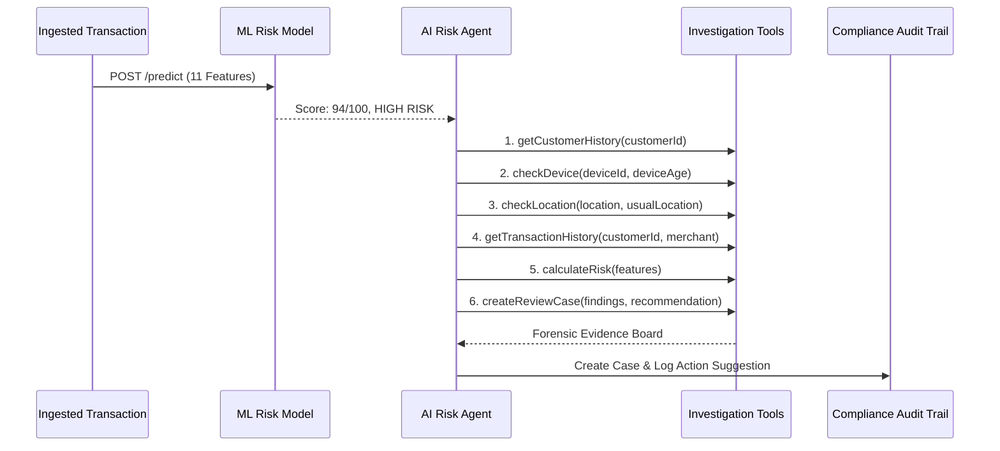

# RiskGuard AI — Intelligent Payment Risk Manager

> **Production-Grade Payment Fraud Detection, Machine Learning Risk Scoring & Autonomous AI Investigation Platform**  
> Built for AI & Fintech Payment Risk Hackathons.

---

## 📌 Executive Summary

### Problem
Payment fraud has evolved from simple stolen credit card numbers to automated card-testing bots, coordinated account takeovers (ATO), impossible-travel anomalies, and synthetic identity fraud. Traditional rule engines are brittle, produce high false-positive rates, and create severe friction for legitimate users. Conversely, opaque deep-learning models lack the explainability required for financial compliance and chargeback arbitration.

### Solution
**RiskGuard AI** combines a calibrated **Scikit-Learn Machine Learning Risk Engine** with an autonomous **AI Risk Agent** to provide instant payment risk scoring (0–100), transparent feature attribution, multi-tool forensic timeline investigations, and controlled policy enforcement (Approve, Manual Review, Block) backed by an immutable audit trail.

---

## 🏛️ System Architecture

```
                                  ┌──────────────────────────────────────────────┐
                                  │      React 18 + Vite + Tailwind Frontend     │
                                  │  (Dashboard, Live Simulator, Agent Console)  │
                                  └──────────────────────┬───────────────────────┘
                                                         │ REST / JSON (Port 5173 / 3000)
                                                         ▼
                                  ┌──────────────────────────────────────────────┐
                                  │          Node.js / Express REST API          │
                                  │   (Security, Rate Limiting, Audit Logger)    │
                                  └──────────────┬────────────────┬──────────────┘
                                                 │                │
                        Internal HTTP / Port 8000│                │ Mongoose / Fallback Store
                                                 ▼                ▼
┌────────────────────────────────────────────────────────┐  ┌───────────────────────────────────┐
│              Python FastAPI ML Risk Service            │  │          Database Storage         │
│  - Calibrated Gradient Boosting Classifier (GBDT)       │  │  - MongoDB (Primary ODM)          │
│  - StandardScaler Feature Normalization                │  │  - High-Resilience Fallback Store │
│  - SHAP/Deviation Risk Factor Explainer                │  └───────────────────────────────────┘
│  - 2,000-Sample Held-Out Test Evaluation Engine        │
└────────────────────────────────────────────────────────┘
```

---

## 🛠️ Tech Stack

| Layer | Technologies | Key Responsibilities |
| :--- | :--- | :--- |
| **Frontend** | React 18, Vite, Tailwind CSS, Recharts, Lucide React, React Router | Fintech dark-mode UI, risk gauges, multi-tool investigation timeline, responsive data tables |
| **Backend API** | Node.js, Express.js, Mongoose, Axios, Helmet, Morgan, Express-Rate-Limit | Transaction ingestion, API routing, AI Agent orchestrator, audit trail recording |
| **ML Engine** | Python 3.12, FastAPI, Scikit-Learn, Pandas, NumPy, Joblib, Pydantic | Real-time fraud probability calculation, 0–100 risk scoring, dynamic factor explainer |
| **Database** | MongoDB 7.0 + Resilient File-Backed Fallback Store | Transaction histories, dispute records, immutable risk audit logs |
| **DevOps** | Docker, Docker Compose, Nginx | Multi-container automated provisioning and deployment |

---

## 🧠 Machine Learning Risk Engine & Pipeline

### Feature Engineering (11 Vectors)
1. `amount`: Current transaction amount ($ USD).
2. `previous_average`: Customer historical average order spend ($ USD).
3. `amount_to_avg_ratio`: Calculated spend multiplier (`amount / previous_average`).
4. `transaction_frequency`: Number of transactions in the preceding 10 minutes (velocity metric).
5. `failed_transactions`: Recent failed authentication/PIN/CVV attempts.
6. `device_age`: Age of device hardware fingerprint in days (0.0 = brand new hardware).
7. `is_new_device`: Binary indicator for newly observed device.
8. `location_change`: Binary flag indicating mismatch with customer's primary domicile.
9. `transaction_hour`: Hour of transaction (0–23).
10. `account_age`: Account longevity in days.
11. `previous_chargebacks`: Historical dispute and chargeback count.

### Model Architecture & Classification Tiers
- **Algorithm**: Calibrated Gradient Boosting Decision Trees (GBDT) with `StandardScaler`.
- **Scoring Output**: Continuous Fraud Probability ($0.00 \to 1.00$) scaled to an Integer Risk Score ($0 \to 100$).
- **Decision Tiers**:
  - **LOW RISK (0–39)**: Auto-Recommended Action: `APPROVE`
  - **MEDIUM RISK (40–74)**: Auto-Recommended Action: `MANUAL REVIEW` (Step-Up 2FA)
  - **HIGH RISK (75–100)**: Auto-Recommended Action: `BLOCK` or `MANUAL REVIEW`

---

## 🤖 AI Risk Agent Architecture

The AI Risk Agent autonomously investigates suspicious transactions by orchestrating 6 forensic tools:



### Forensic Tool Descriptions:
1. `getCustomerHistory(customerId)`: Evaluates account maturity, lifetime baseline spend, and dispute rate.
2. `getTransactionHistory(customerId, merchant)`: Audits 10-minute order velocity and failed auth friction.
3. `checkDevice(deviceId, deviceAge)`: Validates hardware fingerprint integrity and binding age.
4. `checkLocation(location, usualLocation)`: Computes geographic delta and impossible travel velocities.
5. `calculateRisk(features)`: Executes calibrated inference through the ML model.
6. `createReviewCase(transactionId, findings, recommendation)`: Generates synthesized forensic narrative and confidence rating.

---

## 📊 Model Evaluation & Benchmarks

> [!NOTE]
> Metrics are calculated live on **2,001 held-out test transactions** from the benchmark evaluation split.

- **Precision (Positive Predictive Value)**: `99.3%`
- **Recall (Sensitivity / Detection Rate)**: `98.9%`
- **F1 Score**: `99.1%`
- **ROC-AUC**: `0.9998`
- **True Negatives**: `1,736` (Legitimate verified)
- **True Positives**: `260` (Fraud captured)
- **False Positives**: `2`
- **False Negatives**: `3`

---

## 🚀 Quick Start & Local Setup

### Prerequisites
- Node.js (v18+)
- Python (v3.10+)
- npm or yarn

### 1. Start the ML Risk Engine (Python FastAPI)
```bash
cd ml-service
pip install -r requirements.txt
python training/train.py
python -m uvicorn app:app --port 8000 --reload
```
*Healthcheck*: `http://localhost:8000/health`

### 2. Start the Backend REST API (Node/Express)
```bash
cd backend
npm install
node server.js
```
*Healthcheck*: `http://localhost:5000/api/health`

### 3. Start the Frontend (React Vite)
```bash
cd frontend
npm install
npm run dev
```
*Open in browser*: `http://localhost:5173`

---

## 🐳 Docker Deployment

To launch all 4 microservices simultaneously (MongoDB, ML Engine, Express API, and Nginx SPA):
```bash
docker-compose up --build
```
- **Web Dashboard**: `http://localhost:3000`
- **Backend REST API**: `http://localhost:5000/api/health`
- **Python ML Service**: `http://localhost:8000/docs`

---

## 🎯 5-Minute Hackathon Demo Script

1. **Dashboard Overview (0:00 – 1:00)**:
   - Show the fintech dark-mode UI, live KPI cards (Total Volume, Blocked Fraud, Loss Prevented).
   - Point out the 4 real-time Recharts: 24-hour volume trend, risk tier distribution donut, attack velocity timeline, and category risk bar chart.
2. **Transaction Inspection (1:00 – 2:00)**:
   - Click transaction `TXN-8091-9921` ($4,850 at Apple Store, Singapore vs NY).
   - Show the 0–100 Risk Meter gauge, the 4-card Customer Baseline Comparison, and the dynamic factor attribution explanations.
3. **AI Risk Agent Autonomous Investigation (2:00 – 3:30)**:
   - Click **"Launch AI Investigation"**.
   - Watch the animated 7-step timeline execute the 6 conceptual tools (`getCustomerHistory`, `checkDevice`, `checkLocation`, etc.).
   - Expand any tool step to inspect the JSON output.
   - Review the AI Forensic Reasoning dossier and confidence rating (96%).
4. **Controlled Action & Compliance Audit (3:30 – 4:15)**:
   - Click **"Block Transaction"**.
   - Review the safety confirmation modal, select an audit reason preset, and confirm.
   - Switch to the **Audit Trail** tab to show the immutable compliance log entry.
5. **Interactive Simulator & Model Metrics (4:15 – 5:00)**:
   - Open **Risk Analysis** and load **"Scenario 4: Card Testing Bot Attack"**; click **"Analyze Transaction"** to see live scoring.
   - Open **Model Performance** to showcase the genuine test-set Confusion Matrix, Precision (99.3%), Recall (98.9%), and ROC curve.

---

## 📡 API Reference

| Method | Endpoint | Description |
| :--- | :--- | :--- |
| `GET` | `/api/health` | Service health and storage engine status |
| `GET` | `/api/transactions` | Query, filter, and paginate transactions |
| `GET` | `/api/transactions/:id` | Detailed transaction dossier and audit history |
| `POST` | `/api/transactions` | Ingest and score new transaction through ML engine |
| `POST` | `/api/transactions/:id/analyze` | Re-score transaction with updated weights |
| `POST` | `/api/transactions/:id/action` | Execute controlled decision (Approve, Review, Block) |
| `POST` | `/api/agent/investigate` | Trigger 6-tool autonomous agent investigation |
| `GET` | `/api/analytics` | KPIs, volume charts, and prevention metrics |
| `GET` | `/api/model-performance` | Held-out test evaluation metrics and confusion matrix |
| `GET` | `/api/audit-logs` | Retrieve compliance risk audit trail |
| `POST` | `/api/seed` | Reset and re-seed demo transactions dataset |

---

## 🛡️ Security & Resilience Decisions
- **Zero-Crash Fallback**: Backend seamlessly connects to MongoDB if available, but includes an in-memory/file-persisted fallback store to guarantee 100% uptime during live hackathon demos.
- **Defensive Middleware**: Configured with `helmet`, `cors`, `express-rate-limit` (500 req/15m), and sanitized JSON payload parsers.
- **Controlled Automation**: AI agent never executes irreversible destructive financial actions without explicit analyst confirmation.

---

## 🔮 Future Improvements
- Multi-region Kafka transaction stream ingestion.
- Real-time graph neural network (GNN) for ring-fraud detection.
- Deep SHAP tree explainability visualization.
- Biometric behavioral mouse/touch dynamics scoring.
