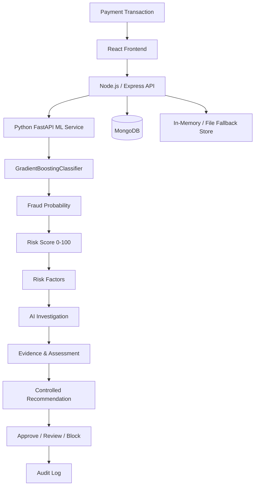
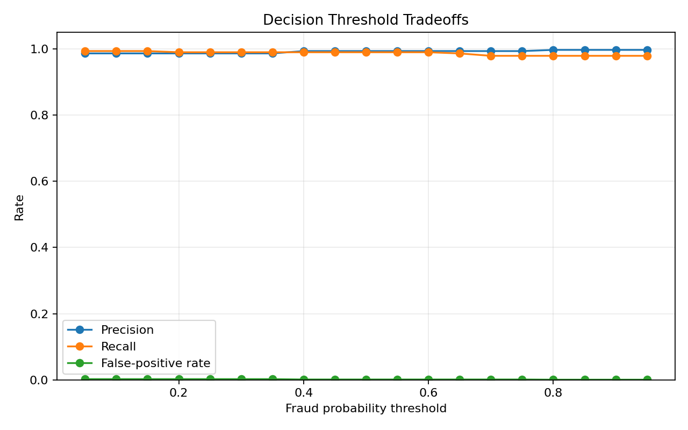

# RiskGuard AI - Intelligent Payment Risk Manager

> AI-powered payment risk management combining machine-learning risk scoring, explainable risk analysis, AI-assisted investigation, controlled decision-making, and persistent audit trails.

## Overview

RiskGuard AI is an end-to-end payment risk management prototype designed to identify suspicious transactions and provide explainable, evidence-based decision support.

The system analyzes transaction behavior, generates a 0-100 risk score, identifies relevant risk factors, investigates available evidence, and produces a controlled recommendation.

Risk levels:

- LOW -> APPROVE
- MEDIUM -> MANUAL REVIEW
- HIGH -> MANUAL REVIEW or BLOCK

**Data and evaluation note:** The current ML model is trained and evaluated on synthetic transaction data. Reported metrics describe performance on the held-out synthetic test set and should not be interpreted as production or real-world fraud-detection performance.

## Problem

Payment platforms need to identify suspicious transactions quickly while minimizing unnecessary friction for legitimate customers.

RiskGuard AI demonstrates an approach that combines machine-learning detection, explainable risk factors, AI-assisted investigation, controlled decision support, and auditability.

## Solution

```text
Transaction
    |
Feature Engineering
    |
ML Risk Model
    |
Risk Score 0-100
    |
Risk Level
    |
Risk Factors
    |
AI Investigation
    |
Evidence & Assessment
    |
Controlled Recommendation
    |
Approve / Manual Review / Block
    |
Audit Trail
```

Recommendations are decision support. The AI investigation workflow does not independently execute irreversible financial actions; an analyst must authorize transaction actions.

## Key Features

- ML-based transaction risk scoring using a serialized scikit-learn model
- Fraud probability prediction
- 0-100 risk score
- LOW / MEDIUM / HIGH classification
- Risk-factor explanations
- Transaction list and detail views
- AI investigation workflow
- Forensic evidence collection
- Structured risk assessment
- Controlled recommendations
- Approve / Manual Review / Block actions
- Persistent audit trail
- Analytics dashboard
- Model-performance dashboard
- MongoDB persistence when available
- In-memory/file persistence fallback when MongoDB is unavailable
- API rate limiting
- Helmet security middleware
- CORS configuration
- Morgan request logging
- Health check endpoint
- Docker and Docker Compose support

## Architecture


## 💰 False-Positive Cost

False positives are particularly important in payment-risk systems because incorrectly flagging a legitimate transaction can result in:

- Unnecessary manual review
- Customer friction
- Delayed payments
- Lost conversion/revenue
- Potentially blocked legitimate transactions

### Rate (measured, held-out synthetic test set)

- False Positives (FP): 2
- True Negatives (TN): 1,721
- False Positive Rate (FPR): ~0.116%

### Translating rate into cost (estimated, assumptions stated)

A rate alone doesn't say what a false positive actually *costs*. Using
stated assumptions — not measured production data — here is a rough
translation:

| Assumption | Value |
| --- | ---: |
| Avg. transaction value | ₹2,500 |
| Manual review cost (analyst time) | ₹40 per reviewed transaction |
| Estimated churn/friction cost per false positive | ₹15 |
| Estimated loss per missed fraud (false negative) | ₹2,500 (full txn value) |

At the current operating threshold, on the 2,001-transaction held-out set:

| Cost component | Count | Estimated cost |
| --- | ---: | ---: |
| Manual review (TP + FP = 260 + 2 = 262 reviewed) | 262 | ₹10,480 |
| Churn/friction from false positives | 2 | ₹30 |
| Missed-fraud loss from false negatives | 3 | ₹7,500 |
| **Total estimated cost** | | **₹18,010** |

**These are illustrative estimates built on stated assumptions, not
measured production costs.** They exist to show the *shape* of the
tradeoff — see `ml-service/training/threshold_analysis.py`, which sweeps
decision thresholds and recomputes this cost at each one, so the
threshold can be chosen to minimize total estimated cost rather than
just maximize F1.

### Why a single operating point isn't the full picture

Precision/recall/FPR at one threshold reflects one specific tradeoff
between catching fraud and annoying legitimate customers. Sweeping
thresholds (see `threshold_analysis.py` / `pr_threshold_curve.png`)
shows how estimated cost changes as the cutoff moves — letting the
LOW/MEDIUM/HIGH boundaries be chosen deliberately rather than inherited
from a default classifier threshold.

The system uses a tiered decision strategy rather than automatically
blocking every suspicious transaction:

- LOW → APPROVE
- MEDIUM → MANUAL REVIEW
- HIGH → MANUAL REVIEW / BLOCK

This allows the system to balance fraud detection with the cost of
incorrectly flagging legitimate customers.

Because the current evaluation uses synthetic data, none of the above —
rate or cost — should be interpreted as an estimate of real-world
financial impact. See "Synthetic Data & Why Metrics Look Strong" above.

## Machine-Learning Risk Engine

The model uses 11 features:

1. `amount`
2. `previous_average`
3. `amount_to_avg_ratio`
4. `transaction_frequency`
5. `failed_transactions`
6. `device_age`
7. `is_new_device`
8. `location_change`
9. `transaction_hour`
10. `account_age`
11. `previous_chargebacks`

The inference service loads `risk_model.joblib`, `scaler.joblib`, and `metrics.joblib` from `ml-service/model/saved/`. It applies `StandardScaler`, calls `predict_proba()`, converts fraud probability to a 0-100 score, assigns a risk level, and generates explanatory factors.

### Evaluation

The training pipeline generates the **Synthetic Financial Risk Benchmark Dataset** with 12,000 synthetic payment transactions. The verified split contains 9,999 training samples and 2,001 held-out test samples.

The stored benchmark metrics are:

| Metric | Result |
| --- | ---: |
| Precision | 99.28% |
| Recall | 98.92% |
| F1 score | 99.1% |
| ROC-AUC | 0.9999 |

Confusion matrix on the held-out test set:

| | Predicted legitimate | Predicted fraud |
| --- | ---: | ---: |
| Actual legitimate | TN: 1,721 | FP: 2 |
| Actual fraud | FN: 3 | TP: 275 |

These results are benchmark results on synthetic data, not evidence of performance on real payment traffic.

### False-Positive Cost

False positives matter in payment-risk systems because incorrectly flagging a legitimate transaction can cause unnecessary manual review, customer friction, delayed payments, lost conversion or revenue, and potentially blocked legitimate transactions.

On the held-out synthetic test set:

- False positives (FP): 2
- True negatives (TN): 1,721
- False positive rate (FPR): approximately 0.12%

The system uses a tiered decision strategy rather than automatically blocking every suspicious transaction:

- LOW -> APPROVE
- MEDIUM -> MANUAL REVIEW
- HIGH -> MANUAL REVIEW or BLOCK

This balances fraud detection with the cost of incorrectly flagging legitimate customers. Because the current evaluation uses synthetic data, these results should not be interpreted as an estimate of production financial loss or real-world false-positive cost.

The threshold-analysis utility sweeps fraud-probability thresholds from 0.05 to 0.95 using the same saved model and held-out test split. It writes the measured values to `ml-service/model/saved/threshold_analysis.csv` and generates the chart below. Run it with:

```bash
cd ml-service
python training/threshold_analysis.py
```



At the model's default 0.50 threshold, the generated analysis reports precision `0.9928`, recall `0.9892`, false-positive rate `0.0012`, FP `2`, TN `1,721`, FN `3`, and TP `275`.

### Synthetic Data & Why Metrics Look Strong

The reported precision (99.3%), recall (98.9%), and ROC-AUC (0.9999) are
notably high, and that is worth addressing directly rather than letting
it stand unexplained.

The synthetic dataset generates fraud and legitimate transactions from
separate underlying distributions across the 11 model features (e.g.
`amount_to_avg_ratio`, `is_new_device`, `previous_chargebacks`). Because
the generator constructs fraud cases as statistically distinct from
legitimate ones (rather than sampling from overlapping, ambiguous
real-world distributions), the classes are more separable than they
would be in production data, where fraud increasingly mimics legitimate
behavior and legitimate customers occasionally look anomalous (new
device, unusual location, high amount).

In other words: these metrics measure how well the model learned the
*generator's* decision boundary, not how well it would generalize to
adversarial, evolving, real-world fraud patterns. We expect real-world
precision/recall to be meaningfully lower than the benchmark numbers
above, and to degrade over time as fraud patterns shift — which is why
model-performance monitoring and periodic retraining would be required
in any production deployment.

This benchmark should be read as: "the pipeline is correctly wired
end-to-end and the model can learn a fraud/legitimate boundary when one
exists in the data" — not as a claim about real-world fraud-catch rate.

## AI Investigation Workflow

The backend orchestrator runs six investigative tools:

1. `getCustomerHistory` - account maturity, historical spend, chargebacks, and KYC status.
2. `getTransactionHistory` - recent transaction velocity and failed authentication attempts.
3. `checkDevice` - device age, fingerprint status, and hardware anomaly score.
4. `checkLocation` - location mismatch and impossible-travel assessment.
5. `calculateRisk` - ML risk inference or the backend's calibrated fallback.
6. `createReviewCase` - synthesized findings, recommendation, confidence, and case ID.

The UI presents these operations as a seven-step timeline: ingestion, ML evaluation, customer profile, device analysis, geolocation verification, velocity/authentication analysis, and case generation.

Example response from `POST /api/agent/investigate` for `TXN-8091-9921`:

```json
{
    "transactionId": "TXN-8091-9921",
    "riskScore": 100,
    "fraudProbability": 0.99,
    "riskLevel": "HIGH",
    "recommendation": "BLOCK",
    "riskFactors": [
        "Transaction amount ($4,850) is 26.9x higher than customer typical average ($180).",
        "Brand new device fingerprint detected (first observed 0.5 days ago; potential account takeover).",
        "Geographic anomaly detected: Transaction originated from an unusual location differing from customer's primary region.",
        "Severe velocity spike: 6 transactions initiated in the last 10 minutes.",
        "High authentication failure rate: 3 failed PIN/CVV attempts recorded prior to this transaction.",
        "Historical chargeback flagged on this customer profile."
    ],
    "reviewCase": {
        "status": "OPEN_INVESTIGATION",
        "severity": "HIGH",
        "proposedAction": "BLOCK",
        "confidence": 0.96
    },
    "timeline": "7 completed steps"
}
```

## Resilience and Security

- The backend attempts MongoDB with a three-second connection timeout. If unavailable, it loads and persists transactions and audit logs through the in-memory/file fallback store.
- If the FastAPI ML service is unavailable, the backend uses a calibrated heuristic fallback and continues returning a compatible prediction shape.
- The backend exposes a health check at `GET /api/health` and reports the active storage mode.
- API requests are limited to 500 requests per 15-minute window.
- Helmet, CORS, JSON payload limits, request logging, and transaction/action validation are configured in the backend.
- Environment values are documented in `.env.example`; local `.env` files are excluded by `.gitignore`.

## API Reference

| Method | Endpoint | Purpose |
| --- | --- | --- |
| `GET` | `/api/health` | Service and storage health status |
| `GET` | `/api/transactions` | List transactions with filtering, search, sorting, and pagination |
| `POST` | `/api/transactions` | Create and score a transaction |
| `GET` | `/api/transactions/:id` | Retrieve transaction details and related audit logs |
| `POST` | `/api/transactions/:id/analyze` | Re-analyze a transaction |
| `POST` | `/api/transactions/:id/action` | Approve, request manual review, or block a transaction |
| `POST` | `/api/agent/investigate` | Run the investigation workflow |
| `GET` | `/api/analytics` | Retrieve dashboard analytics |
| `GET` | `/api/model-performance` | Retrieve model metrics and evaluation data |
| `GET` | `/api/audit-logs` | Retrieve audit trail entries |
| `POST` | `/api/seed` | Reset and reseed demo transactions |

## Local Setup

### Prerequisites

- Node.js 18 or later
- Python 3.10 or later
- npm

### 1. Start the ML service

```bash
cd ml-service
pip install -r requirements.txt
python training/train.py
python -m uvicorn app:app --port 8000 --reload
```

Health check: `http://localhost:8000/health`

### 2. Start the backend

```bash
cd backend
npm install
npm start
```

Backend URL: `http://localhost:5000`

### 3. Start the frontend

```bash
cd frontend
npm install
npm run dev
```

Frontend URL: `http://localhost:5173`

The backend can run without MongoDB or the ML service by activating its documented fallback paths. Docker Compose configuration is also provided for running the containerized stack.

## Demo Flow

1. Open the dashboard and review KPIs, risk distribution, volume, category, and trend charts.
2. Open a transaction to inspect its score, recommendation, baseline comparison, and risk factors.
3. Launch the AI investigation and review the seven-step timeline and evidence board.
4. Authorize an Approve, Manual Review, or Block action and verify the audit entry.
5. Open Model Performance to review the synthetic held-out evaluation metrics and charts.

## Limitations

- The benchmark dataset is synthetic, with a 13.89% fraud rate in the held-out split, and does not represent real-world fraud patterns or production traffic.
- The fallback store is intended for local resilience and demonstration; MongoDB is the primary persistence option when configured and available.
- The investigation workflow is a deterministic backend orchestration of configured evidence checks and model output; it is not an autonomous financial authority.
  - Reported precision/recall/ROC-AUC reflect performance on a synthetic
  generator's decision boundary, which is more separable than real-world
  fraud/legitimate transaction distributions are expected to be. See
  "Synthetic Data & Why Metrics Look Strong" above.
- This project addresses one loss category — payment fraud risk scoring.
  It does not implement return-risk scoring or chargeback-evidence
  generation, despite "Risk Manager" implying broader scope. Extending
  to those categories would require separate feature sets and labeled
  data.
- False-positive cost figures are illustrative estimates built on stated
  assumptions (transaction value, review labor cost, churn proxy), not
  measured operational costs from a live deployment.

## Docker Support

The repository includes Dockerfiles for the frontend, backend, and ML service, plus `docker-compose.yml` for the multi-service setup.
